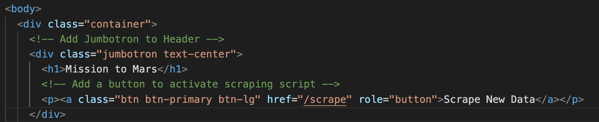
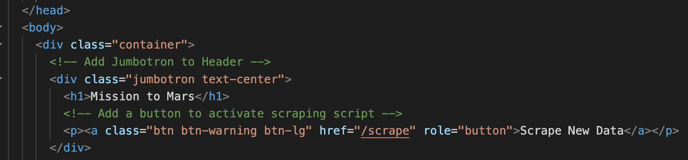
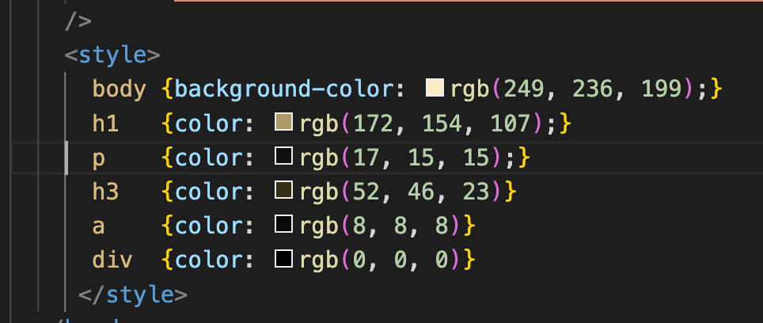
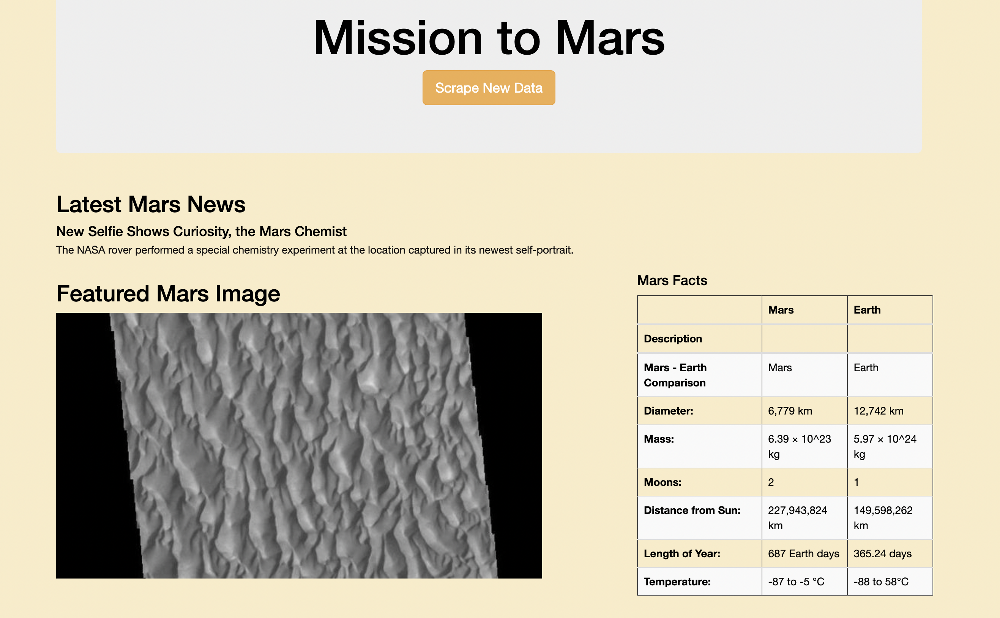

# Mission-to-Mars

## Overview of Project
The purpose of the web-scraping project was to use the tools listed below in the resource section to build a web application to scrape various website for data related to the mission to mars and present the data and images on a single page. The final task was to add two additional Bootstrap 3 components to the index.html file inside the templates folder. 
The original "Scrape New Data" button code is below.
 
After styling the "Scrape New Data" button by changing the button class from primary to warning. 
 
The code below is the second Bootstrap 3 components to enhance the webpages style.  
 

---

## Resource: 

Websites Used:  
* NASA Mars News 
* Jet Propulsion Laboratory's Space Images 
* Mars Facts 
* Mars Hemispheres 

Tools Used:  

Visual Studio Code, Anaconda, Jupyter Notebook, Python, HTML, BeautifulSoup, Splinter, MongoDB, Webdriver_Manager, PyMongo, Flask Application, Datetime, Pandas  
 
 
---

## Results and Summary: 
An image of the final mobile-responsive web-scraping application.

 

---
